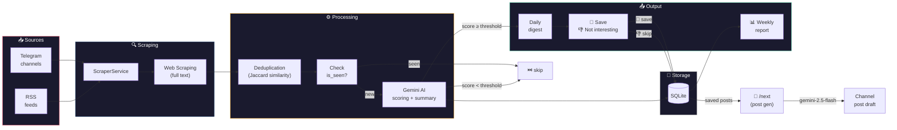
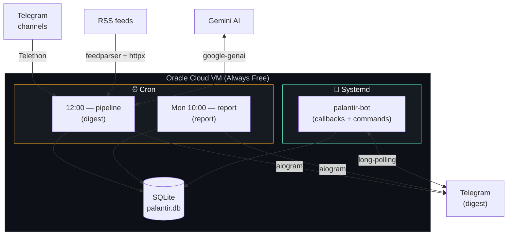

<p align="center">
  
</p>

<h1 align="center">Palantir</h1>

<p align="center">
  <em>The all-seeing eye for Data Science content</em>
</p>

<p align="center">
  
  
  
  
</p>

---

An automated content curator bot that daily scans Telegram channels and RSS feeds, analyzes materials using Google Gemini AI, and sends a personal digest of the most interesting publications via Telegram.

<p align="center">
  
</p>

## Pipeline



## Architecture



## Features

- **Content Scraping** — Telegram channels (Telethon) + RSS feeds with automatic full-text web scraping
- **AI Analysis** — Google Gemini scores each publication on a 10-point scale with Ukrainian-language summaries
- **Deduplication** — filtering similar content from different sources (Jaccard similarity)
- **Daily Digest** — sorted recommendations by rating with reaction buttons (📌 Save / 👎 Not interesting)
- **Post Generation** — `/next` command generates a ready-to-publish channel post from saved materials using Gemini 2.5 Flash in the author's style
- **Weekly Report** — statistics: processed, recommended, score distribution, top sources
- **Telegram Commands** — `/status`, `/sources`, `/report`, `/run`, `/next`, `/help`
- **Rate limiting** — built-in limiter with retry for Gemini free tier
- **API Key Rotation** — automatic fallback to a second Gemini key when daily quota is exhausted
- **Dashboard** — Streamlit app for analytics (local launch)

## Quick Start

### Requirements

- Python 3.12+
- [uv](https://docs.astral.sh/uv/) (package manager)
- Telegram API credentials ([my.telegram.org](https://my.telegram.org))
- Telegram Bot Token ([@BotFather](https://t.me/BotFather))
- Google Gemini API Key ([ai.google.dev](https://ai.google.dev))

### Installation

```bash
git clone https://github.com/Aranaur/palantir.git
cd palantir
uv sync --no-dev
cp .env.example .env
# Fill .env with your keys
```

### First Run

```bash
# Interactive Telethon login (run once)
uv run python -m palantir.main

# Run bot to process buttons
uv run python -m palantir.bot

# Weekly report
uv run python -m palantir.report

# Dashboard (locally)
uv run streamlit run src/palantir/dashboard.py
```

### Configuration `.env`

```env
# Telegram Userbot (Telethon)
TG_API_ID=12345678
TG_API_HASH=your_api_hash_here
TG_CHANNELS=["@channel1", "@channel2"]

# RSS Feeds
RSS_FEEDS=["https://example.com/feed.xml"]

# Google Gemini
GEMINI_API_KEY=your_gemini_api_key
GEMINI_API_KEY_2=your_second_key  # optional, auto-switches on daily quota exhaustion
GEMINI_MODEL=gemini-3.1-flash-lite-preview  # scoring model (500 RPD free tier)
POST_GEN_MODEL=gemini-2.5-flash             # post generation for /next (20 RPD free tier)

# Telegram Bot (aiogram)
BOT_TOKEN=123456:ABC-DEF...
ADMIN_ID=123456789
TG_CHANNEL=@your_channel  # optional, for /next feature

# Pipeline
SCORE_THRESHOLD=6
SCRAPE_LIMIT=50
AI_RPM_LIMIT=15
```

## Deployment (Oracle Cloud Free Tier)

<details>
<summary>Step-by-step guide</summary>

### 1. Create VM

- Oracle Cloud → Compute → Create Instance
- Shape: `VM.Standard.A1.Flex` (1 OCPU, 6 GB RAM) or `VM.Standard.E2.1.Micro` (1 GB RAM)
- Image: Ubuntu 22.04

### 2. Install dependencies

```bash
sudo add-apt-repository ppa:deadsnakes/ppa -y
sudo apt update && sudo apt install -y python3.12 python3.12-venv git sqlite3
curl -LsSf https://astral.sh/uv/install.sh | sh
```

### 3. Deploy

```bash
git clone https://github.com/Aranaur/palantir.git
cd palantir && uv sync --no-dev
nano .env  # fill in the keys
uv run python -m palantir.main  # first run for Telethon login
```

### 4. Systemd service (pipeline, one-shot)

```ini
# /etc/systemd/system/palantir.service
[Unit]
Description=Palantir Bot
After=network.target

[Service]
User=ubuntu
WorkingDirectory=/home/ubuntu/palantir
ExecStart=/home/ubuntu/.local/bin/uv run python -m palantir.main
Restart=no
StandardOutput=append:/home/ubuntu/palantir.log
StandardError=append:/home/ubuntu/palantir.log

[Install]
WantedBy=multi-user.target
```

### 5. Systemd service (callback bot)

```ini
# /etc/systemd/system/palantir-bot.service
[Unit]
Description=Palantir Callback Bot
After=network.target

[Service]
User=ubuntu
WorkingDirectory=/home/ubuntu/palantir
ExecStart=/home/ubuntu/.local/bin/uv run python -m palantir.bot
Restart=on-failure
StandardOutput=append:/home/ubuntu/palantir-bot.log
StandardError=append:/home/ubuntu/palantir-bot.log

[Install]
WantedBy=multi-user.target
```

```bash
sudo systemctl enable palantir-bot --now
```

### 6. Sudoers for bot restart

```bash
sudo visudo -f /etc/sudoers.d/palantir
```

```
ubuntu ALL=(ALL) NOPASSWD: /bin/systemctl start palantir-bot, /bin/systemctl restart palantir-bot
```

### 7. Cron schedule

```bash
crontab -e
```

```cron
# Digest daily at 12:00 (Kyiv, UTC+3)
0 9 * * * sudo systemctl start palantir

# Weekly report (Monday 10:00 Kyiv)
0 7 * * 1 cd /home/ubuntu/palantir && /home/ubuntu/.local/bin/uv run python -m palantir.report >> /home/ubuntu/palantir-report.log 2>&1
```

### 8. Swap (for 1 GB RAM VM)

```bash
sudo fallocate -l 1G /swapfile
sudo chmod 600 /swapfile
sudo mkswap /swapfile
sudo swapon /swapfile
echo '/swapfile none swap sw 0 0' | sudo tee -a /etc/fstab
```

</details>

## Telegram Commands

| Command | Description |
|---------|------|
| `/help` | List of commands |
| `/status` | Statistics for today |
| `/sources` | List of all sources |
| `/report` | Weekly report |
| `/run` | Run pipeline manually |
| `/next` | Generate a post draft for the channel from saved materials |

## Project Structure

```
palantir/
├── src/palantir/
│   ├── main.py              # Pipeline entry point (one-shot)
│   ├── bot.py               # Telegram bot (callbacks + commands incl. /next)
│   ├── report.py            # Weekly report script
│   ├── dashboard.py         # Streamlit dashboard
│   ├── config.py            # Settings (pydantic-settings)
│   ├── pipeline.py          # Orchestrator: scrape → AI → notify
│   ├── models/
│   │   └── post.py          # RawPost, ScoredPost, FinalPost
│   └── services/
│       ├── ai_service.py    # Gemini AI: scoring + post generation + key rotation
│       ├── db_service.py    # SQLite (aiosqlite): posts, feedback, published
│       ├── dedup_service.py # Jaccard similarity dedup
│       ├── notification_service.py  # Telegram digest + reports
│       └── scraper_service.py       # Telethon + RSS + web scraping
├── data/
│   └── palantir.db          # SQLite database
├── assets/
│   ├── palantir-logo.png    # Project logo
│   └── palantir-banner.png  # Banner image
├── .env.example
└── pyproject.toml
```

## License

MIT

---

<p align="center">
  <em>"He who controls information controls the world"</em>
</p>
