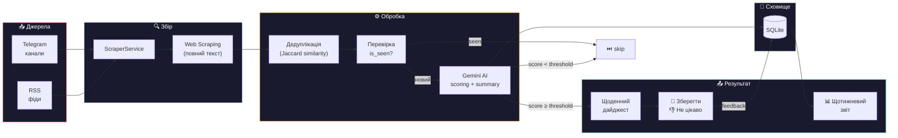
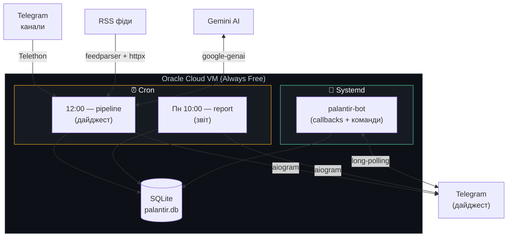

<p align="center">
  
</p>

<h1 align="center">Palantir</h1>

<p align="center">
  <em>Всевидяче око для Data Science контенту</em>
</p>

<p align="center">
  
  
  
  
</p>

---

Автоматизований бот-куратор контенту, який щодня сканує Telegram-канали та RSS-фіди, аналізує матеріали за допомогою Google Gemini AI та надсилає персональний дайджест найцікавіших публікацій у Telegram.

<p align="center">
  
</p>

## Pipeline



## Архітектура



## Можливості

- **Збір контенту** — Telegram канали (Telethon) + RSS фіди з автоматичним web scraping повного тексту
- **AI аналіз** — Google Gemini оцінює кожну публікацію за 10-бальною шкалою
- **Дедуплікація** — фільтрація схожого контенту з різних джерел (Jaccard similarity)
- **Щоденний дайджест** — відсортовані за рейтингом рекомендації з кнопками реакцій
- **Щотижневий звіт** — статистика: оброблено, рекомендовано, розподіл оцінок, топ джерела
- **Telegram команди** — `/status`, `/sources`, `/report`, `/run`, `/help`
- **Rate limiting** — вбудований лімітер з retry для Gemini free tier
- **Dashboard** — Streamlit-додаток для аналітики (запуск локально)

## Швидкий старт

### Вимоги

- Python 3.12+
- [uv](https://docs.astral.sh/uv/) (менеджер пакетів)
- Telegram API credentials ([my.telegram.org](https://my.telegram.org))
- Telegram Bot Token ([@BotFather](https://t.me/BotFather))
- Google Gemini API Key ([ai.google.dev](https://ai.google.dev))

### Встановлення

```bash
git clone https://github.com/Aranaur/palantir.git
cd palantir
uv sync --no-dev
cp .env.example .env
# Заповни .env своїми ключами
```

### Перший запуск

```bash
# Інтерактивний логін Telethon (один раз)
uv run python -m palantir.main

# Запуск бота для обробки кнопок
uv run python -m palantir.bot

# Щотижневий звіт
uv run python -m palantir.report

# Dashboard (локально)
uv run streamlit run src/palantir/dashboard.py
```

### Налаштування `.env`

```env
# Telegram Userbot (Telethon)
TG_API_ID=12345678
TG_API_HASH=your_api_hash_here
TG_CHANNELS=["@channel1", "@channel2"]

# RSS Feeds
RSS_FEEDS=["https://example.com/feed.xml"]

# Google Gemini
GEMINI_API_KEY=your_gemini_api_key
GEMINI_MODEL=gemini-2.0-flash

# Telegram Bot (aiogram)
BOT_TOKEN=123456:ABC-DEF...
ADMIN_ID=123456789

# Pipeline
SCORE_THRESHOLD=7
SCRAPE_LIMIT=20
AI_RPM_LIMIT=8
```

## Деплой (Oracle Cloud Free Tier)

<details>
<summary>Покрокова інструкція</summary>

### 1. Створити VM

- Oracle Cloud → Compute → Create Instance
- Shape: `VM.Standard.A1.Flex` (1 OCPU, 6 GB RAM) або `VM.Standard.E2.1.Micro` (1 GB RAM)
- Image: Ubuntu 22.04

### 2. Встановити залежності

```bash
sudo add-apt-repository ppa:deadsnakes/ppa -y
sudo apt update && sudo apt install -y python3.12 python3.12-venv git
curl -LsSf https://astral.sh/uv/install.sh | sh
```

### 3. Деплой

```bash
git clone https://github.com/Aranaur/palantir.git
cd palantir && uv sync --no-dev
nano .env  # заповнити ключі
uv run python -m palantir.main  # перший запуск для логіну Telethon
```

### 4. Systemd сервіс (pipeline, one-shot)

```ini
# /etc/systemd/system/palantir.service
[Unit]
Description=Palantir Bot
After=network.target

[Service]
User=ubuntu
WorkingDirectory=/home/ubuntu/palantir
ExecStart=/home/ubuntu/.local/bin/uv run python -m palantir.main
Restart=no
StandardOutput=append:/home/ubuntu/palantir.log
StandardError=append:/home/ubuntu/palantir.log

[Install]
WantedBy=multi-user.target
```

### 5. Systemd сервіс (callback бот)

```ini
# /etc/systemd/system/palantir-bot.service
[Unit]
Description=Palantir Callback Bot
After=network.target

[Service]
User=ubuntu
WorkingDirectory=/home/ubuntu/palantir
ExecStart=/home/ubuntu/.local/bin/uv run python -m palantir.bot
Restart=on-failure
StandardOutput=append:/home/ubuntu/palantir-bot.log
StandardError=append:/home/ubuntu/palantir-bot.log

[Install]
WantedBy=multi-user.target
```

```bash
sudo systemctl enable palantir-bot --now
```

### 6. Cron розклад

```bash
crontab -e
```

```cron
# Дайджест щодня о 12:00 (Київ, UTC+3)
0 9 * * * sudo systemctl start palantir

# Щотижневий звіт (понеділок 10:00 Київ)
0 7 * * 1 cd /home/ubuntu/palantir && /home/ubuntu/.local/bin/uv run python -m palantir.report >> /home/ubuntu/palantir-report.log 2>&1
```

</details>

## Telegram команди

| Команда | Опис |
|---------|------|
| `/help` | Список команд |
| `/status` | Статистика за сьогодні |
| `/sources` | Список усіх джерел |
| `/report` | Щотижневий звіт |
| `/run` | Запустити pipeline вручну |

## Структура проєкту

```
palantir/
├── src/palantir/
│   ├── main.py              # Pipeline entry point (one-shot)
│   ├── bot.py               # Telegram bot (callbacks + commands)
│   ├── report.py            # Weekly report script
│   ├── dashboard.py         # Streamlit dashboard
│   ├── config.py            # Settings (pydantic-settings)
│   ├── pipeline.py          # Orchestrator: scrape → AI → notify
│   ├── models/
│   │   └── post.py          # RawPost, ScoredPost, FinalPost
│   └── services/
│       ├── ai_service.py    # Gemini AI + rate limiting + retry
│       ├── db_service.py    # SQLite (aiosqlite)
│       ├── dedup_service.py # Jaccard similarity dedup
│       ├── notification_service.py  # Telegram digest + reports
│       └── scraper_service.py       # Telethon + RSS + web scraping
├── data/
│   └── palantir.db          # SQLite database
├── assets/
│   ├── palantir-logo.png    # Project logo
│   └── palantir-banner.png  # Banner image
├── .env.example
└── pyproject.toml
```

## Ліцензія

MIT

---

<p align="center">
  <em>"Той, хто контролює інформацію, контролює світ"</em>
</p>
